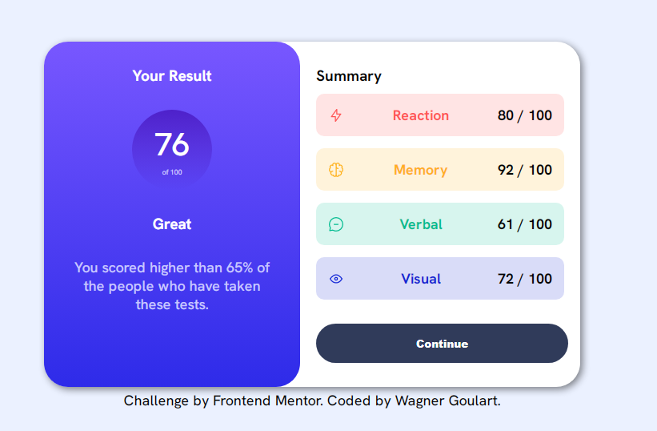

# Frontend Mentor - Results summary component solution

This is a solution to the [Results summary component challenge on Frontend Mentor](https://www.frontendmentor.io/challenges/results-summary-component-CE_K6s0maV). Frontend Mentor challenges help you improve your coding skills by building realistic projects. 

### The challenge

Users should be able to:

- View the optimal layout for the interface depending on their device's screen size
- See hover and focus states for all interactive elements on the page

### Screenshot



### Links

- Solution URL: [here](https://wagner-goulart.github.io/results-summary-component-main/)

### Built with

- Semantic HTML5 markup
- CSS custom properties
- Flexbox
- JavaScript

### What I learned

How to consume a external JSON file.
I used de function bellow to access the file and used it

```js
function insertData() {
    fetch('src/js/data.json').then((response)=>{
        response.json().then((data)=>{
            for(let i = 0; i<item.length; i++) {
                image[i].src = data[i].icon
                category[i].innerHTML  = data[i].category
                score[i].innerHTML = `${data[i].score} / 100`
            }
        })
        
    })
}
```

